### Установка helm и kompose

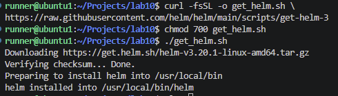
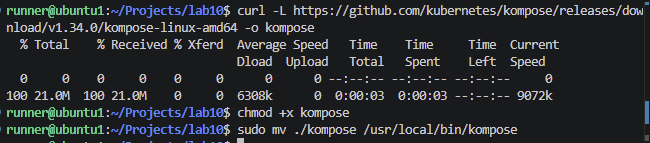

### Собрал и развернул инфраструктуру

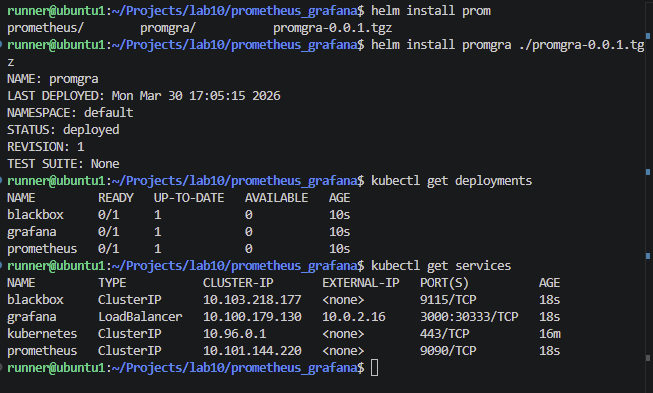
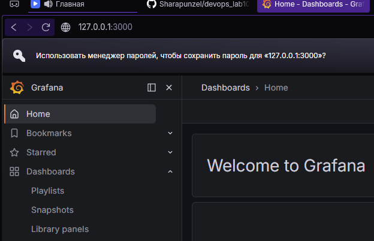

Благодаря kompose сконвертировал доккер-компоуз манифесты в куберовские и с помощью helm сделал пакет, далее его установил - на выходе получил развернутую инфраструктуру (то что было в пакете)

### Работа с переменными

Сделал новый ямл и проверил что рендер произошел, проверил также изменение переменной через терминал

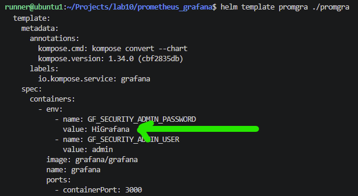
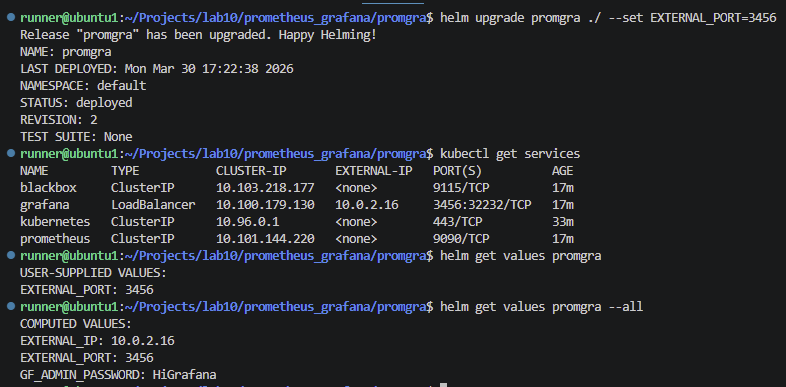
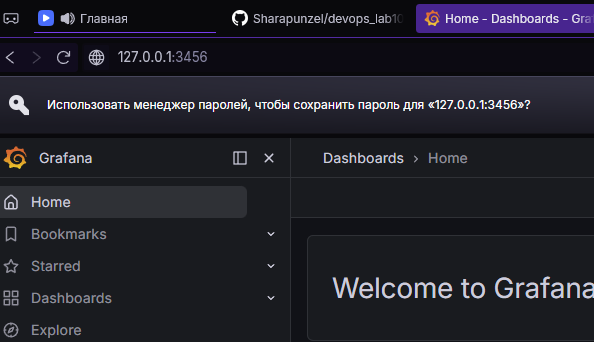

### Демонтаж релиза

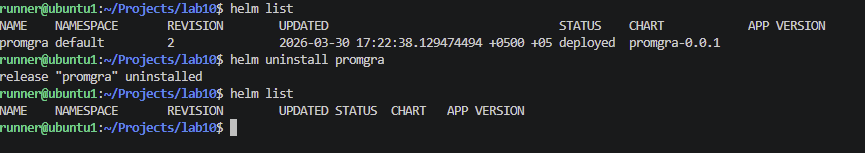

### Пробуем kustomize

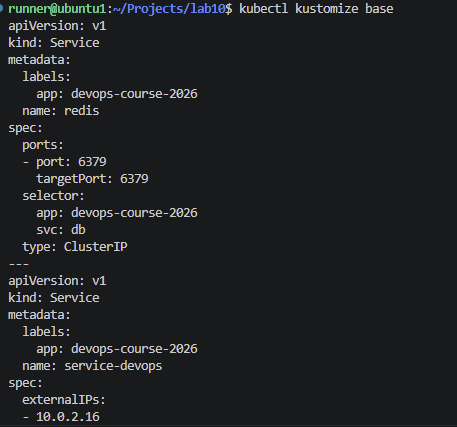

### Делим на 2 окружения

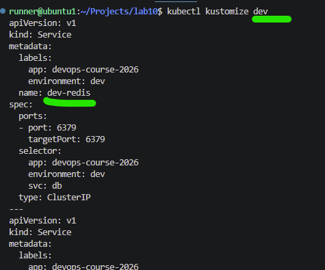
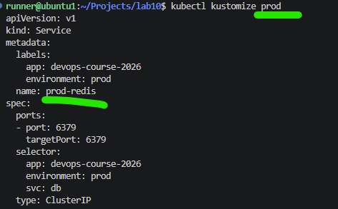

Изменил порт для дева и применил изменения в кластер (потом изменил для дева на порт 55555, для прода на 44444)

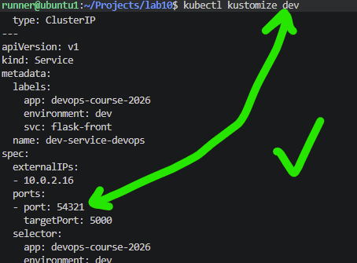
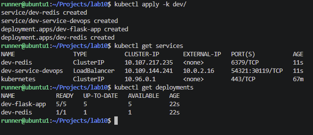

Применил изменения в кластер для прода

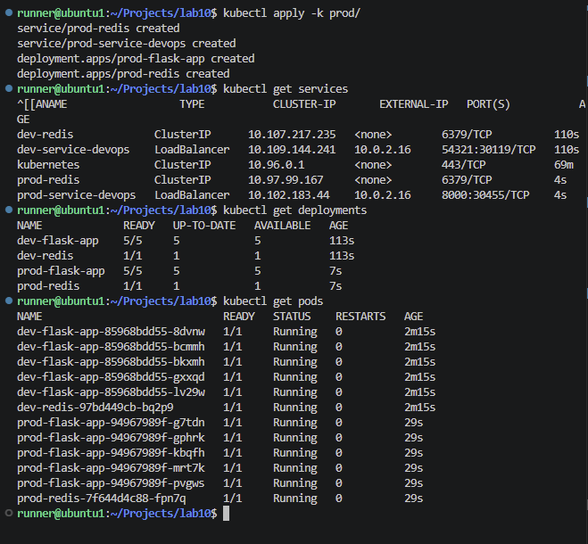

Затем изменяю количество реплик сервиса для дева (было 5 стало 2)

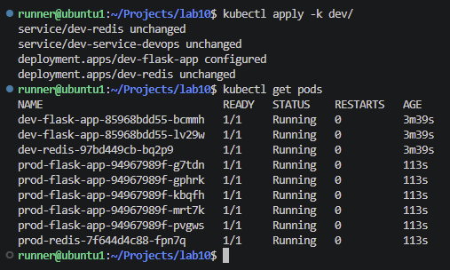

Пересобираю образ

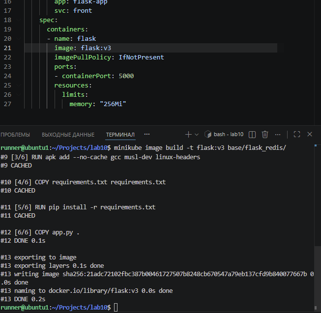
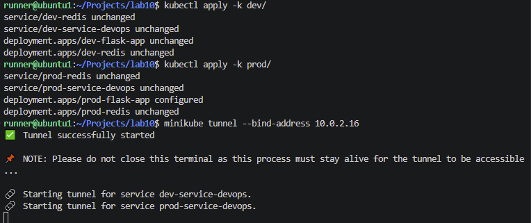

### Проверка работы 2 окружений

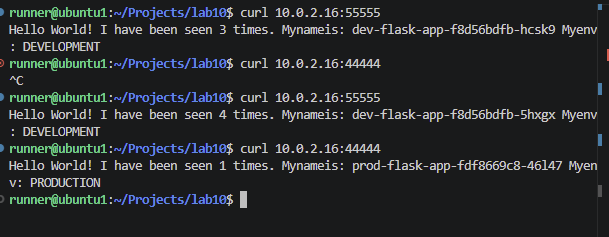